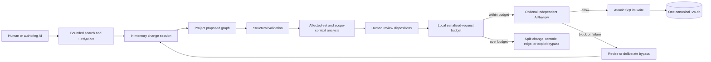
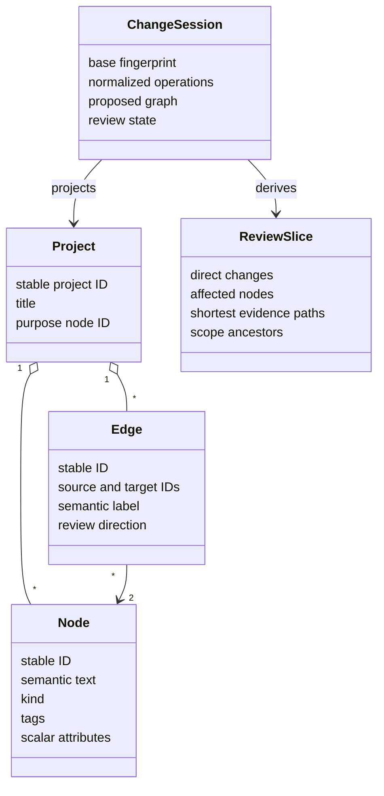

# ValidatedWorld Self-Blueprint Review

## Verdict

ValidatedWorld is already capable of representing and navigating a substantial
semantic blueprint and of safely committing ordinary piecewise changes. It is
not yet ready to claim that every newly authored world necessarily entered
through the promised review path, because the public structured
`project.init` command can currently establish a complete populated graph.
T15 closes that trust-boundary bug.

The evaluated blueprint contains 134 nodes and 219 explicit edges. It describes
the product purpose, domain model, scope rules, affected propagation, review
state, SQLite boundary, CLI/NDJSON surfaces, optional AI roles, implemented
limits, product risks, and roadmap decisions.

## Core model and flow

The semantic reviewer receives one current change: operations, declared affected
nodes, explanation paths, and required scope lineages. It does not receive the
complete project merely because the project is large. Projects are expected to
grow through many naturally small reviews. A legitimate local change can still
have a broad affected set, so T16 adds a local size check before any provider
call; it does not split the proposal into automatic reviewer calls.

## What the real use case demonstrated

- A detailed model of the application itself fits naturally in the graph rather
  than becoming a code-shaped one-to-one transcription.
- Stable IDs, kinds, namespaced tags, purpose-rooted scope, dependency paths,
  exact-tag lookup, and bounded reads make the model browsable after its source
  no longer fits in one agent context.
- The manual change workflow can update the blueprint, recalculate the affected
  slice, record review, and commit atomically.
- Unrelated branches can remain outside a local review when the declared
  dependencies do not reach them. This is the intended behavior, not a missing
  guarantee.
- A small live AIReview check behaved usefully: an unsupported evidence claim
  was blocked without changing SQLite; a revised plain note was allowed. The
  successful call used 2,133 total tokens. No authoring-agent call was used.

## What it did not prove

The initial populated blueprint was admitted through the current full-graph
`project.init` path. It received deterministic structural validation, but not
the same semantic write gate that later changes receive. Later corrections used
normal review sessions, with an explicit AIReview bypass so the private
blueprint was not sent as a large provider request.

Therefore the database is a useful, detailed blueprint and a real browsing
case, but it is not evidence that the new-world bootstrap contract is already
correct. T15 requires a purpose-only public bootstrap and a repeatable piecewise
replay. It must never solve that gap by sending the baseline or entire project
to AIReview.

## Gap decisions

| Concern | Decision |
|---|---|
| Large reviewer inputs | Add a pre-provider request-size rejection with a breakdown. Ask for a smaller natural change, better modeling, or deliberate bypass; do not auto-partition. |
| Missing dependency edges | Accept as an inherent semantic modeling risk. Improve search, neighbor inspection, and author instructions; never pull every node as a substitute. |
| Literal retrieval | Add ranked lexical retrieval first. Evaluate semantic similarity later as advisory candidate discovery. |
| Full graph load per bounded query | Not a correctness or AI-context leak: “bounded” describes returned content, while the complete graph is currently validated locally. Optimize only if measurements show user-visible cost. |
| Process-local drafts | Accepted product boundary. The shell warning is sufficient. |
| Populated initialization | Real bug. Public creation must be purpose-only; first tree additions use ordinary review and optional AIReview. Existing verified databases are trusted on open. |
| One omission record per omitted item | Real bounded-output bug. Replace with grouped counts, a sample, and paged detail. |
| Near-limit benchmark | Not a launch priority. The self-blueprint and another realistic corpus are better evidence; optimize when their use reveals a problem. |

## Files

- `ValidatedWorld.Blueprint.vw.db` is the inspectable SQLite project in the
  repository root. It currently verifies at 134 nodes, 219 edges, and state
  fingerprint
  `26fb46a514020ef931d621e5e3c4d8443753a5bdb56716373cd3821dbdd80b40`.
  The repository ignores `.vw.db` files by design, so the binary will not
  appear in Git status.
- `samples/ValidatedWorldBlueprint/baseline.json` is the tracked, reviewable
  source exported from that database.
- `docs/product_roadmap.md` records the prioritized product decisions, and
  `docs/development_plan.md` contains implementation-ready tasks.
